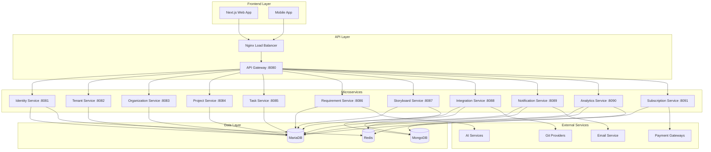
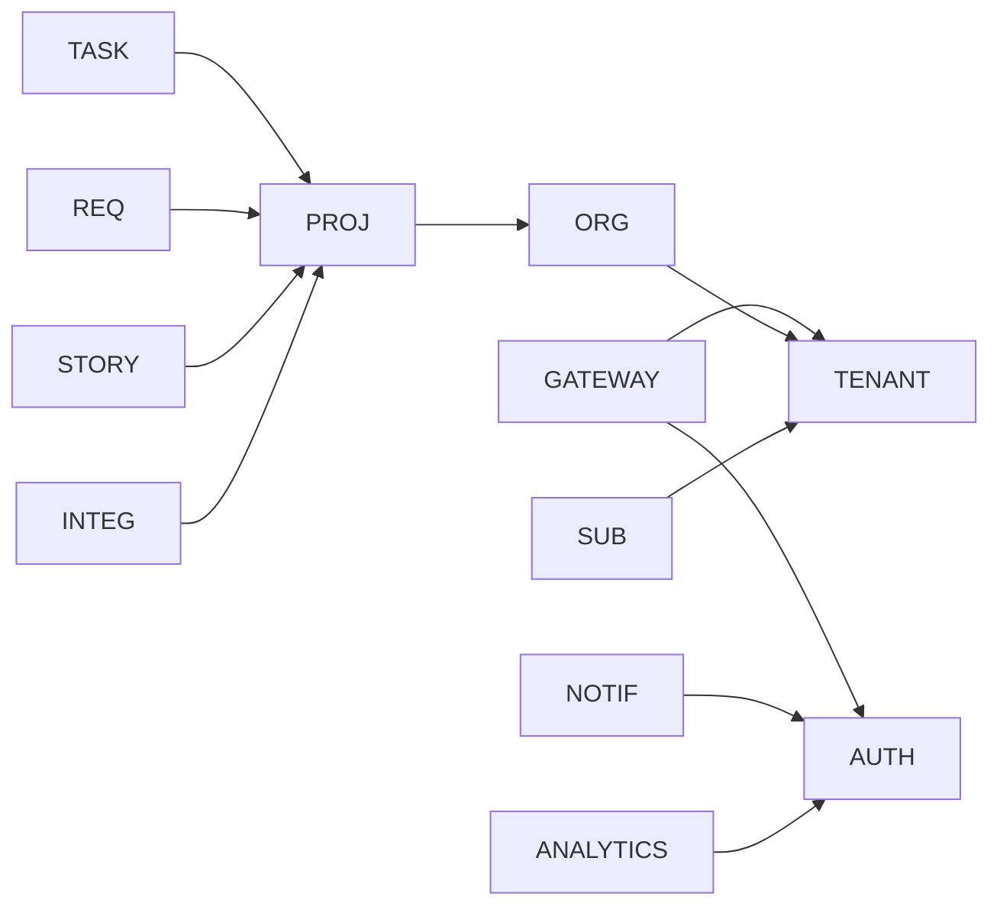

# One Plan Infrastructure

<div align="center">


**AI-Enhanced Project Management Platform**

[](https://github.com/TwelveNexus/one-plan/actions)
[](https://github.com/TwelveNexus/one-plan/actions)
[](LICENSE)

</div>

## 📋 Table of Contents

- [Overview](#overview)
- [Architecture](#architecture)
- [Quick Start](#quick-start)
- [Services](#services)
- [Development](#development)
- [Deployment](#deployment)
- [Monitoring](#monitoring)
- [Troubleshooting](#troubleshooting)
- [Contributing](#contributing)

## 🎯 Overview

One Plan is a microservices-based project management platform that leverages AI to revolutionize project planning and execution. This infrastructure repository contains everything needed to build, test, and deploy the complete system.

### 🏗️ Architecture Highlights

- **12 Microservices** with domain-driven design
- **Multi-tenant SaaS** architecture
- **AI-powered** requirement analysis and planning
- **Real-time collaboration** with WebSocket support
- **Multi-database** strategy (MariaDB, MongoDB, Redis)
- **Container-first** deployment with Docker
- **CI/CD pipeline** with GitHub Actions
- **Production-ready** monitoring and health checks

## 🏛️ Architecture



## 🚀 Quick Start

### Prerequisites

- **Docker** 20.10+ and Docker Compose
- **Java** 21 (for local development)
- **Node.js** 20+ (for frontend)
- **Git** 2.30+

### 1. Clone and Setup

```bash
# Clone the repository
git clone https://github.com/TwelveNexus/one-plan.git
cd one-plan

# Make scripts executable
chmod +x infrastructure/ci-cd/scripts/*.sh
chmod +x infrastructure/docker/docker-healthcheck.sh

# Copy environment configuration
cp infrastructure/docker/.env.example infrastructure/docker/.env.local
```

### 2. Start Development Environment

```bash
# Start all services with Docker Compose
cd infrastructure/docker
docker-compose up -d

# Check service health
./../../ci-cd/scripts/health-check.sh --all --environment local
```

### 3. Verify Installation

```bash
# API Gateway should be accessible
curl http://localhost:8080/actuator/health

# All services should be running
docker-compose ps
```

🎉 **You're ready!** The complete One Plan infrastructure is now running locally.

## 🔧 Services

| Service | Port | Description | Database |
|---------|------|-------------|----------|
| **API Gateway** | 8080 | Main entry point, routing | - |
| **Identity Service** | 8081 | Authentication, user management | MariaDB + Redis |
| **Tenant Service** | 8082 | Multi-tenant management | MariaDB |
| **Organization Service** | 8083 | Organizations and teams | MariaDB |
| **Project Service** | 8084 | Project management | MariaDB |
| **Task Service** | 8085 | Tasks and comments | MariaDB |
| **Requirement Service** | 8086 | AI-powered requirements | MariaDB |
| **Storyboard Service** | 8087 | Visual planning | MariaDB + MongoDB |
| **Integration Service** | 8088 | Git and external APIs | MariaDB + MongoDB |
| **Notification Service** | 8089 | Multi-channel notifications | MariaDB + Redis |
| **Analytics Service** | 8090 | Metrics and reporting | MariaDB + MongoDB + Redis |
| **Subscription Service** | 8091 | Billing and payments | MariaDB |

### Service Dependencies



## 💻 Development

### Local Development Setup

1. **Database Setup**
```bash
# Start databases only
docker-compose up -d mariadb mongodb redis

# Wait for databases to be ready
./infrastructure/ci-cd/scripts/health-check.sh --services mariadb,mongodb,redis
```

2. **Run Services Individually**
```bash
# Run specific service
cd backend/api-gateway
./gradlew bootRun

# Or run multiple services
cd infrastructure/ci-cd/scripts
./build.sh --services api-gateway,identity-service
```

3. **Testing**
```bash
# Run all tests
./infrastructure/ci-cd/scripts/test.sh --all --coverage

# Run specific service tests
./infrastructure/ci-cd/scripts/test.sh --services identity-service --type unit

# Run integration tests
./infrastructure/ci-cd/scripts/test.sh --all --type integration
```

### Development Workflow

1. **Feature Development**
   - Create feature branch: `git checkout -b feature/your-feature`
   - Make changes and test locally
   - Run tests: `./infrastructure/ci-cd/scripts/test.sh --all`
   - Build images: `./infrastructure/ci-cd/scripts/build.sh --all`

2. **Pull Request**
   - Push branch and create PR
   - Automated checks will run:
     - Code quality analysis
     - Security scanning
     - Unit and integration tests
     - Docker build verification

3. **Deployment**
   - Merge to `main` triggers automatic deployment
   - Monitor deployment: `./infrastructure/ci-cd/scripts/health-check.sh --all`

### Code Quality Standards

- **Test Coverage**: Minimum 80% for new code
- **Code Style**: Checkstyle and SpotBugs enforced
- **Security**: Trivy scanning for vulnerabilities
- **Documentation**: All public APIs documented

## 🚀 Deployment

### Production Deployment (Coolify)

1. **Configure Secrets**
   
   Set these secrets in your GitHub repository:
   ```
   COOLIFY_URL=https://your-coolify-instance.com
   COOLIFY_TOKEN=your-coolify-api-token
   
   # Service UUIDs (get from Coolify dashboard)
   COOLIFY_API_GATEWAY_UUID=uuid-for-api-gateway
   COOLIFY_IDENTITY_SERVICE_UUID=uuid-for-identity-service
   ... (for each service)
   
   # Service URLs for health checks
   COOLIFY_API_GATEWAY_URL=https://api.yourdomain.com
   COOLIFY_IDENTITY_SERVICE_URL=https://auth.yourdomain.com
   ... (for each service)
   ```

2. **Deploy All Services**
```bash
# Deploy to production
./infrastructure/ci-cd/scripts/deploy.sh --all --environment production

# Deploy specific services
./infrastructure/ci-cd/scripts/deploy.sh --services api-gateway,identity-service

# Deploy with health checks
./infrastructure/ci-cd/scripts/deploy.sh --all --environment production
```

3. **Monitor Deployment**
```bash
# Check deployment status
./infrastructure/ci-cd/scripts/health-check.sh --all --environment production

# Continuous monitoring
./infrastructure/ci-cd/scripts/health-check.sh --all --continuous --environment production
```

### Environment Configuration

| Environment | Purpose | Database | Monitoring |
|-------------|---------|----------|------------|
| **Local** | Development | Docker containers | Basic health checks |
| **Staging** | Pre-production testing | Coolify managed | Enhanced monitoring |
| **Production** | Live system | Coolify managed | Full observability |

### Scaling Configuration

```yaml
# Recommended resource allocation per service
api-gateway:     CPU: 0.5, Memory: 1GB
identity-service: CPU: 0.5, Memory: 1GB
tenant-service:   CPU: 0.2, Memory: 512MB
organization-service: CPU: 0.3, Memory: 512MB
project-service:  CPU: 0.5, Memory: 1GB
task-service:     CPU: 0.5, Memory: 1GB
requirement-service: CPU: 0.5, Memory: 1GB (AI processing)
storyboard-service: CPU: 0.5, Memory: 1GB (MongoDB operations)
integration-service: CPU: 0.3, Memory: 512MB
notification-service: CPU: 0.3, Memory: 512MB
analytics-service: CPU: 1.0, Memory: 2GB (data processing)
subscription-service: CPU: 0.3, Memory: 512MB
```

## 📊 Monitoring

### Health Checks

```bash
# Quick health check
curl http://localhost:8080/actuator/health

# Comprehensive health check
./infrastructure/ci-cd/scripts/health-check.sh --all --format table

# JSON output for monitoring tools
./infrastructure/ci-cd/scripts/health-check.sh --all --format json
```

### Metrics and Logging

- **Application Metrics**: Spring Boot Actuator endpoints
- **System Metrics**: Docker container stats
- **Logs**: Structured JSON logging
- **Tracing**: Request tracing across services

### Alerting

Configure webhook alerts:
```bash
# Set up alerting
export ALERT_WEBHOOK_URL=https://hooks.slack.com/your-webhook
./infrastructure/ci-cd/scripts/health-check.sh --all --continuous --alert-webhook $ALERT_WEBHOOK_URL
```

## 🐛 Troubleshooting

### Common Issues

#### 1. Service Won't Start
```bash
# Check logs
docker-compose logs service-name

# Check health
./infrastructure/ci-cd/scripts/health-check.sh --services service-name

# Restart service
docker-compose restart service-name
```

#### 2. Database Connection Issues
```bash
# Check database status
docker-compose ps mariadb mongodb redis

# Check connection from service
docker-compose exec api-gateway curl http://mariadb:3306
```

#### 3. Build Failures
```bash
# Clean build
./infrastructure/ci-cd/scripts/build.sh --all --no-cache

# Check Docker daemon
docker info
```

### Performance Issues

#### High Memory Usage
```bash
# Check container memory
docker stats

# Tune JVM settings in Dockerfiles
ENV JAVA_OPTS="-XX:MaxRAMPercentage=75.0"
```

#### Slow Response Times
```bash
# Check service health and response times
./infrastructure/ci-cd/scripts/health-check.sh --all --format table

# Monitor database performance
docker-compose exec mariadb mysqladmin processlist
```

### Debug Mode

Enable debug logging:
```bash
# Set debug environment
export DEBUG_MODE=true
export LOG_LEVEL=DEBUG

# Restart services
docker-compose restart
```

## 🤝 Contributing

### Development Environment Setup

1. **Fork and Clone**
```bash
git clone https://github.com/TwelveNexus/one-plan.git
cd one-plan
```

2. **Set Up Pre-commit Hooks**
```bash
# Install pre-commit
pip install pre-commit

# Install hooks
pre-commit install
```

3. **Run Tests Before Committing**
```bash
./infrastructure/ci-cd/scripts/test.sh --all
```

### Contribution Guidelines

1. **Code Style**: Follow existing patterns and use provided linters
2. **Testing**: Maintain 80%+ test coverage
3. **Documentation**: Update README and API docs
4. **Security**: No secrets in code, scan dependencies
5. **Performance**: Consider impact on response times

### Pull Request Process

1. Create feature branch from `develop`
2. Make changes with tests
3. Update documentation
4. Create PR with detailed description
5. Address review feedback
6. Merge after approvals

## 📚 Additional Documentation

- [**Docker Setup Guide**](docker/README.md) - Detailed Docker configuration
- [**CI/CD Pipeline**](ci-cd/README.md) - Build and deployment processes
- [**API Documentation**](../docs/api/README.md) - Service API specifications
- [**Deployment Guide**](DEPLOYMENT.md) - Production deployment details
- [**Architecture Decisions**](../docs/architecture/README.md) - Design decisions and patterns

## 📞 Support

- **Documentation**: [docs/](../docs/)
- **Issues**: [GitHub Issues](https://github.com/TwelveNexus/one-plan/issues)
- **Discussions**: [GitHub Discussions](https://github.com/TwelveNexus/one-plan/discussions)
- **Email**: [info@apavayan.com](mailto:info@apavayan.com)

## 📄 License

This project is licensed under the MIT License - see the [LICENSE](../LICENSE) file for details.

---

<div align="center">

**Built with ❤️ by [Apavayan Sinha](https://github.com/aapav01)**

[Website](https://apavayan.com) • [LinkedIn](https://linkedin.com/in/apavayan) • [GitHub](https://github.com/aapav01)

</div>